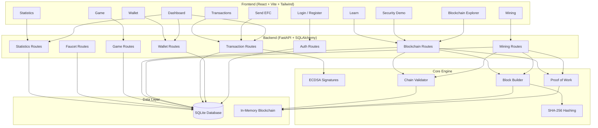

# ELFAIDY COIN

> **Educational Cryptocurrency & Blockchain Simulation Platform**

**Elfaidy Coin (EFC)** is a fully functional educational cryptocurrency and blockchain platform built from scratch to demonstrate how real cryptocurrency systems work internally. It is designed as a learning tool for developers, students, and blockchain enthusiasts who want to understand the mechanics of wallets, transactions, digital signatures, mining, and blockchain integrity — all through a real working application.

---

## IMPORTANT DISCLAIMER

**ELFAIDY COIN IS AN EDUCATIONAL PROJECT ONLY.**

- **EFC has NO real-world monetary value.**
- It does **NOT** connect to real banking systems.
- It does **NOT** process real money.
- It is **NOT** a production cryptocurrency like Bitcoin or Ethereum.
- All transactions occur inside this application's own blockchain/database system.
- Private keys are stored server-side for educational demonstration — this is **NOT** production-grade wallet security.

---

## Why I Built This

Understanding blockchain technology from first principles is difficult when only reading whitepapers or watching videos. Elfaidy Coin bridges that gap by providing a **hands-on, interactive platform** where every concept has a real implementation:

- **Wallets** are real ECDSA key pairs.
- **Transactions** are actually signed with private keys.
- **Mining** runs real Proof of Work.
- **Balances** are derived from actual blockchain state.
- **Tampering** breaks the chain and is detected.

This project demonstrates full-stack engineering, cryptography, distributed systems concepts, and secure API design in a single cohesive application.

---

## Key Features

| Feature | Description |
|---------|-------------|
| **User Accounts** | Registration, login, JWT authentication, bcrypt password hashing |
| **Auto Wallet Generation** | Every user gets a unique wallet with ECDSA keys on registration |
| **Balance Tracking** | Real-time confirmed, pending, and available balance calculation |
| **Send EFC** | Transfer between users by username or wallet address |
| **Digital Signatures** | Every transfer is signed with the sender's private key |
| **Signature Verification** | Backend verifies signatures using public keys |
| **Pending Transaction Pool** | Unmined transactions wait in a real pending pool |
| **Double-Spending Protection** | Available balance = confirmed − pending outgoing |
| **Mining** | Real Proof of Work with configurable difficulty |
| **Mining Rewards** | Miners earn EFC for successfully mining blocks |
| **Educational Faucet** | Claim starter EFC with cooldown enforcement |
| **EFC Game** | Browser mini-game with server-validated rewards |
| **Blockchain Explorer** | Inspect every block, hash, nonce, and transaction |
| **Blockchain Validation** | Full-chain integrity check endpoint |
| **Tampering Demo** | Simulate data modification and watch detection |
| **Statistics Dashboard** | Platform-wide metrics and activity |
| **Learn Section** | Beginner-friendly explanations of blockchain concepts |

---

## EFC Ecosystem Flow

```
User registers
    ↓
Account created + Wallet auto-generated (ECDSA keys)
    ↓
Claim Educational Faucet → +100 EFC
    ↓
Dashboard shows balance, stats, quick actions
    ↓
Send EFC to another user
    ↓
Transaction signed with Private Key
    ↓
Signature verified by backend
    ↓
Transaction enters PENDING pool
    ↓
Mine the block (Proof of Work)
    ↓
Block added to Blockchain
    ↓
Transaction status → CONFIRMED
    ↓
Balances updated on-chain
```

Alternative reward flow:
```
Login
    ↓
Play EFC Game (Crypto Catch)
    ↓
Backend validates game session
    ↓
Reward calculated server-side
    ↓
Game Reward Transaction → CONFIRMED
    ↓
EFC Balance updated
```

---

## EFC Game — Crypto Catch

A lightweight browser mini-game where EFC coins fall from the top of the screen and the player controls a wallet at the bottom to catch them.

- **Duration:** ~45 seconds
- **Controls:** Arrow keys or touch to move left/right
- **Coins:** Gold circles = +50 score
- **Penalties:** Red triangles = −30 score
- **Reward formula:** `floor(score / 50)`, capped at 25 EFC

**Critical:** Game rewards are **validated entirely on the backend**:
- Server-generated session ID
- Server-side start timestamp
- Maximum duration enforced
- Maximum score enforced
- One reward per session
- Replay protection

The frontend cannot fake a score. The backend recalculates everything.

---

## Technology Stack

### Backend
| Technology | Purpose |
|------------|---------|
| **Python 3.12+** | Core language |
| **FastAPI** | High-performance async API framework |
| **SQLAlchemy 2.0** | ORM for database operations |
| **SQLite** | Lightweight persistent database |
| **cryptography** | ECDSA key generation & digital signatures |
| **python-jose** | JWT token encoding/decoding |
| **passlib[bcrypt]** | Secure password hashing |
| **Pydantic** | Request/response validation |
| **pytest** | Testing framework |

### Frontend
| Technology | Purpose |
|------------|---------|
| **React 18** | UI library |
| **TypeScript** | Type-safe development |
| **Vite** | Fast build tool & dev server |
| **Tailwind CSS** | Utility-first styling |
| **React Router** | Client-side routing |
| **Axios** | HTTP client |
| **Lucide React** | Icon library |
| **Recharts** | Statistics charts |

---

## Architecture



---

## Blockchain Architecture

### Genesis Block
- Block #0
- Created automatically on first startup
- Contains the initial EFC supply (100,000 EFC)
- Immutable root of the chain

### Block Structure
```
Block:
├── index          → Position in chain
├── timestamp      → Creation time
├── transactions   → List of included transactions
├── previous_hash  → Hash of previous block
├── nonce          → Proof-of-Work solution
├── difficulty     → Number of leading zeros required
├── hash           → SHA-256 of all block data
└── miner_address  → Wallet of the miner
```

### How It Works
1. **SHA-256 Hashing:** Every block's hash is a deterministic function of its data.
2. **Proof of Work:** Miners increment a `nonce` until the hash starts with `0000` (difficulty = 4).
3. **Chain Linkage:** Each block stores the previous block's hash. Change any data → hash changes → next block's `previous_hash` no longer matches → chain is INVALID.
4. **Tampering Detection:** The validation endpoint recomputes every hash and checks every linkage.

---

## Wallet & Cryptography

### Key Generation
1. **ECDSA (SECP256R1)** generates a private/public key pair.
2. The **public key** is hashed with SHA-256 to produce a wallet address: `EFC_<hash_prefix>`.
3. The **private key** signs all outgoing transactions.

### Digital Signatures
```
Private Key
    ↓
Sign Transaction Hash
    ↓
Digital Signature (base64)
    ↓
Anyone with Public Key → Verify Signature
```

**Why signatures matter:**
- **Authentication:** Proves the sender authorized the transaction.
- **Integrity:** Any change to the transaction data invalidates the signature.
- **Non-repudiation:** The sender cannot deny creating it.

---

## Transaction Lifecycle

```
User initiates transfer
    ↓
Backend validates recipient, amount, available balance
    ↓
Transaction payload created (sender, receiver, amount, timestamp)
    ↓
Payload hashed with SHA-256
    ↓
Sender's PRIVATE KEY signs the hash
    ↓
Signature stored with transaction
    ↓
Transaction enters PENDING pool
    ↓
Miner collects pending transactions
    ↓
Proof of Work finds valid nonce
    ↓
Block saved to database + added to chain
    ↓
Transaction status → CONFIRMED
    ↓
Balances recalculated from chain state
```

---

## Mining & Proof of Work

### Process
1. Gather all **PENDING** transactions.
2. Add a **MINING_REWARD** transaction to the miner's wallet.
3. Combine into a block candidate.
4. Set `nonce = 0`.
5. Compute SHA-256 hash of the block.
6. Check if hash starts with `0000` (difficulty = 4).
7. If not, increment `nonce` and repeat.
8. When found, the block is valid and added to the chain.

**Default Settings:**
- Difficulty: 4 → hash must start with `0000`
- Mining Reward: 50 EFC
- Genesis Supply: 100,000 EFC

---

## Security Demo — Tampering Detection

The platform includes an educational tampering simulation:

1. Select any block (e.g., Block #1).
2. Change a transaction amount (e.g., 25 EFC → 2500 EFC).
3. The block's hash is recomputed without re-mining.
4. **Result:** The hash no longer satisfies the difficulty target.
5. The blockchain validation endpoint reports **INVALID**.
6. The next block's `previous_hash` also no longer matches.

This demonstrates why blockchain data is considered **immutable**.

---

## Project Structure

```
ELFAIDY-COIN/
├── backend/
│   ├── app/
│   │   ├── main.py                 # FastAPI entry point
│   │   ├── config.py               # Pydantic settings
│   │   ├── database.py             # SQLAlchemy engine & session
│   │   ├── models.py               # ORM models (User, Wallet, Tx, Block, etc.)
│   │   ├── schemas.py              # Pydantic request/response models
│   │   ├── dependencies.py         # Auth dependencies (JWT, current_user)
│   │   ├── api/
│   │   │   └── routes/
│   │   │       ├── auth.py         # /auth/* endpoints
│   │   │       ├── users.py        # /users/* endpoints
│   │   │       ├── wallets.py      # /wallets/* endpoints
│   │   │       ├── transactions.py # /transactions/* endpoints
│   │   │       ├── blockchain.py   # /blockchain/* endpoints
│   │   │       ├── mining.py       # /mining/* endpoints
│   │   │       ├── game.py         # /game/* endpoints
│   │   │       ├── faucet.py       # /faucet/* endpoints
│   │   │       └── statistics.py   # /statistics/* endpoints
│   │   ├── core/
│   │   │   ├── blockchain/
│   │   │   │   ├── block.py        # Block model & hashing
│   │   │   │   ├── blockchain.py   # Chain management & validation
│   │   │   │   ├── mining.py       # Proof-of-Work engine
│   │   │   │   └── transaction.py  # Transaction signing utilities
│   │   │   ├── crypto/
│   │   │   │   ├── hashing.py      # SHA-256 utilities
│   │   │   │   ├── signatures.py   # ECDSA sign/verify
│   │   │   │   └── wallet.py       # Wallet generation
│   │   │   └── game/
│   │   │       └── game_engine.py  # Server-side game validation
│   │   └── services/
│   │       ├── auth_service.py     # Registration, login, JWT
│   │       ├── wallet_service.py   # Balance calculation, lookups
│   │       ├── transaction_service.py # Tx creation, validation, signing
│   │       ├── blockchain_service.py  # Chain persistence, tampering
│   │       ├── mining_service.py   # Mining orchestration
│   │       ├── game_service.py     # Game session management
│   │       ├── faucet_service.py   # Faucet claims & cooldown
│   │       └── statistics_service.py # Platform metrics
│   └── requirements.txt
├── frontend/
│   ├── src/
│   │   ├── main.tsx                # React entry point
│   │   ├── App.tsx                 # Router & route guards
│   │   ├── index.css               # Tailwind directives
│   │   ├── types/
│   │   │   └── index.ts            # TypeScript interfaces
│   │   ├── contexts/
│   │   │   └── AuthContext.tsx     # JWT auth state
│   │   ├── layouts/
│   │   │   └── MainLayout.tsx      # Sidebar + responsive nav
│   │   ├── services/
│   │   │   ├── api.ts              # Axios instance
│   │   │   ├── auth.ts             # Auth API calls
│   │   │   ├── wallet.ts           # Wallet API calls
│   │   │   ├── transaction.ts      # Transaction API calls
│   │   │   ├── blockchain.ts       # Blockchain API calls
│   │   │   ├── mining.ts           # Mining API calls
│   │   │   ├── game.ts             # Game API calls
│   │   │   ├── faucet.ts           # Faucet API calls
│   │   │   ├── statistics.ts       # Statistics API calls
│   │   │   └── user.ts             # User search API calls
│   │   └── pages/
│   │       ├── Login.tsx
│   │       ├── Register.tsx
│   │       ├── Dashboard.tsx
│   │       ├── WalletPage.tsx
│   │       ├── SendPage.tsx
│   │       ├── TransactionsPage.tsx
│   │       ├── MiningPage.tsx
│   │       ├── BlockchainPage.tsx
│   │       ├── StatisticsPage.tsx
│   │       ├── SecurityPage.tsx
│   │       ├── GamePage.tsx
│   │       ├── LearnPage.tsx
│   │       └── SettingsPage.tsx
│   ├── index.html
│   ├── package.json
│   ├── vite.config.ts
│   ├── tsconfig.json
│   ├── tailwind.config.js
│   └── postcss.config.js
├── .env.example
├── .gitignore
└── LICENSE
```

---

## Installation

### Prerequisites
- Python 3.12+
- Node.js 20+
- npm or yarn

### Backend Setup

```bash
cd backend
python -m venv .venv
source .venv/bin/activate  # Windows: .venv\Scripts\activate
pip install -r requirements.txt

# Start the server
uvicorn app.main:app --reload --port 8000
```

The API will be available at `http://localhost:8000`.

OpenAPI docs: `http://localhost:8000/docs`

### Frontend Setup

```bash
cd frontend
npm install
npm run dev
```

The frontend will be available at `http://localhost:5173`.

### Environment Variables

Copy `.env.example` to `.env` and configure:

```bash
cp .env.example .env
```

| Variable | Default | Description |
|----------|---------|-------------|
| `SECRET_KEY` | (dev key) | JWT signing key — **change in production** |
| `DATABASE_URL` | `sqlite:///./elfaidy_coin.db` | Database connection |
| `GENESIS_SUPPLY` | `100000` | Initial EFC supply |
| `MINING_REWARD` | `50` | EFC earned per mined block |
| `DIFFICULTY` | `4` | PoW leading zeros |
| `FAUCET_REWARD` | `100` | EFC per faucet claim |
| `FAUCET_COOLDOWN_HOURS` | `24` | Hours between claims |
| `MAX_GAME_REWARD` | `25` | Max EFC per game |
| `GAME_DURATION_SECONDS` | `45` | Game time limit |

---

## Docker (Optional)

```bash
docker compose up --build
```

This starts both the backend (`:8000`) and frontend (`:5173`) services.

---

## API Endpoints

### Authentication
| Method | Endpoint | Description |
|--------|----------|-------------|
| POST | `/api/auth/register` | Register new user + auto wallet |
| POST | `/api/auth/login` | Login, receive JWT |
| POST | `/api/auth/logout` | Client-side token discard |
| GET | `/api/auth/me` | Current user profile |

### Wallets
| Method | Endpoint | Description |
|--------|----------|-------------|
| GET | `/api/wallets/me` | My wallet + balance |
| GET | `/api/wallets/{address}` | Public wallet info |
| GET | `/api/wallets/{address}/balance` | Balance breakdown |

### Transactions
| Method | Endpoint | Description |
|--------|----------|-------------|
| POST | `/api/transactions` | Create signed transfer |
| GET | `/api/transactions` | My transaction history |
| GET | `/api/transactions/pending` | Pending transaction pool |
| GET | `/api/transactions/{id}` | Transaction details + signature verification |

### Blockchain
| Method | Endpoint | Description |
|--------|----------|-------------|
| GET | `/api/blockchain` | Chain status |
| GET | `/api/blockchain/validate` | Full validation |
| GET | `/api/blockchain/blocks` | All blocks |
| GET | `/api/blockchain/blocks/{index}` | Single block |
| POST | `/api/blockchain/tamper` | Simulate tampering |

### Mining
| Method | Endpoint | Description |
|--------|----------|-------------|
| POST | `/api/mining/mine` | Mine pending transactions |

### Game
| Method | Endpoint | Description |
|--------|----------|-------------|
| POST | `/api/game/start` | Start game session |
| POST | `/api/game/complete` | Complete & claim reward |
| GET | `/api/game/history` | Past sessions |

### Faucet
| Method | Endpoint | Description |
|--------|----------|-------------|
| GET | `/api/faucet/status` | Claim eligibility |
| POST | `/api/faucet/claim` | Claim EFC |

### Statistics
| Method | Endpoint | Description |
|--------|----------|-------------|
| GET | `/api/statistics` | Platform metrics |

### Health
| Method | Endpoint | Description |
|--------|----------|-------------|
| GET | `/api/health` | Service health |

---

## Testing

The project is designed to be tested with **pytest**.

```bash
cd backend
pytest
```

Recommended test coverage includes:
- User registration & login
- Password hashing & JWT
- Wallet generation & keypair creation
- Digital signature creation & verification
- Transaction creation, validation, & rejection
- Insufficient balance handling
- Double-spending prevention
- Genesis block integrity
- Proof of Work mining
- Mining reward distribution
- Faucet cooldown enforcement
- Game session validation & reward limits
- Blockchain validation & tampering detection
- API endpoint responses
- Database persistence

---

## Example User Flow

### Yousef sends 25 EFC to Ahmed

```
1. Yousef registers → Wallet EFC_AAAAA created
2. Ahmed registers → Wallet EFC_BBBBB created
3. Yousef claims faucet → +100 EFC (confirmed)
4. Yousef sends 25 EFC to Ahmed
   → Backend signs with Yousef's private key
   → Transaction enters PENDING pool
   → Yousef's available balance = 75 EFC
5. Ahmed (or Yousef) mines the block
   → Proof of Work finds nonce with hash starting 0000
   → Block saved, transaction CONFIRMED
6. Final balances:
   Yousef: 75 EFC
   Ahmed: 25 EFC
```

---

## Screenshots

> Screenshots will be added here in a future update.
> The application features a dark-themed, professional cryptocurrency dashboard with:
> - Animated balance cards
> - Real-time transaction tables
> - Interactive blockchain explorer
> - Canvas-based mini-game
> - Security demo with before/after tampering visualization

---

## Educational Disclaimer

**ELFAIDY COIN IS AN EDUCATIONAL SIMULATION.**

- **Not a real cryptocurrency.** EFC tokens have zero monetary value.
- **Not financial advice.** Nothing in this project constitutes investment guidance.
- **Not production security.** Private keys are stored in the database for demonstration. In a real system, private keys must remain exclusively in the user's control (hardware wallets, secure enclaves, or client-side storage).
- **Not a distributed network.** This runs on a single server with a single-node blockchain.
- **For learning only.** The purpose is to understand how blockchain concepts map to real code.

---

## Security Limitations

| Area | Limitation | Why |
|------|-----------|-----|
| Private Keys | Stored server-side | Educational demo; real wallets keep keys client-side |
| Consensus | Single node only | Educational; real networks use thousands of nodes |
| Network | No P2P protocol | Simplified for clarity |
| Game Anti-Cheat | Basic server validation | Educational level; not esports-grade |
| Wallet Encryption | Database-level only | Demo; production needs hardware security modules |

---

## Future Improvements

- **PostgreSQL** migration for production-scale data
- **Redis** for distributed session caching and game state
- **Real P2P networking** with WebSocket or libp2p
- **Merkle trees** for efficient transaction verification within blocks
- **Additional consensus mechanisms** (Proof of Stake, Delegated PoS)
- **Production-grade key management** with HSM or client-side key generation
- **Hardware wallet integration** (MetaMask, Ledger simulation)
- **Smart contract sandbox** for educational contract deployment
- **Mobile app** with React Native
- **Real-time WebSocket updates** for pending transactions and mining

---

## License

This project is licensed under the [MIT License](LICENSE).

Copyright (c) 2026 Elfaidy Coin Project.

Permission is hereby granted, free of charge, to any person obtaining a copy of this software and associated documentation files (the "Software"), to deal in the Software without restriction, including without limitation the rights to use, copy, modify, merge, publish, distribute, sublicense, and/or sell copies of the Software, and to permit persons to whom the Software is furnished to do so, subject to the following conditions:

The above copyright notice and this permission notice shall be included in all copies or substantial portions of the Software.

THE SOFTWARE IS PROVIDED "AS IS", WITHOUT WARRANTY OF ANY KIND, EXPRESS OR IMPLIED, INCLUDING BUT NOT LIMITED TO THE WARRANTIES OF MERCHANTABILITY, FITNESS FOR A PARTICULAR PURPOSE AND NONINFRINGEMENT.
